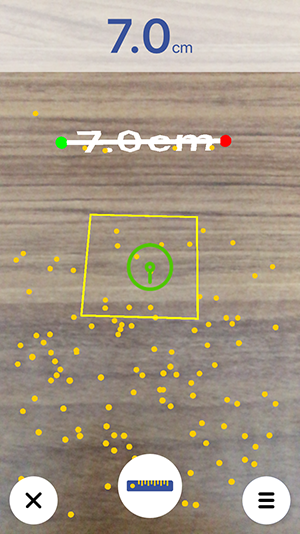
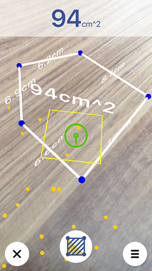

# **Cetvel**
> ARKit ile yapılmış, uzunluk ve alan ölçebilen bir cetvel uygulaması

[![Swift Version][swift-image]][swift-url]  

## Requirements

- Swift 4.0
- iOS 11.0
- Xcode 9.0

## Pods

- OpenCV
- LiquidFloatingActionButton
- SnapKit

## Preview

1. Mesure Length

2. Mesure Area

## Install

- Manually compile
1. `git clone https://github.com/kurtulusahmet/Cetvel`
2. `pod install`
3. Compile project with Xcode

## Contribute

We would love for you to contribute to **Cetvel**.

## Thanks
[Ruler](https://github.com/TBXark/Ruler) A simple AR ruler app can measure length &amp; area

[swift-image]:https://img.shields.io/badge/swift-4.0-orange.svg
[swift-url]: https://swift.org/
[license-image]: https://img.shields.io/badge/License-MIT-blue.svg
[license-url]: LICENSE

